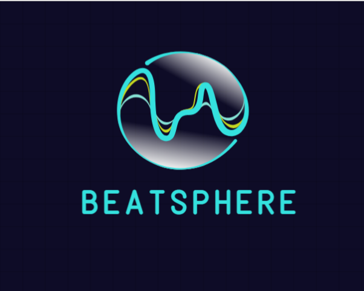

# 🎵 Beatsphere

<div align="center">
  
  <p><em>A modern music streaming application built with Flutter and FastAPI</em></p>
</div>

[](https://flutter.dev/)
[](https://fastapi.tiangolo.com/)
[](LICENSE)
[](CONTRIBUTING.md)

## 📖 Table of Contents

- [Overview](#overview)
- [Features](#features)
- [Screenshots](#screenshots)
- [Architecture](#architecture)
- [Tech Stack](#tech-stack)
- [Getting Started](#getting-started)
  - [Prerequisites](#prerequisites)
  - [Installation](#installation)
  - [Configuration](#configuration)
- [API Documentation](#api-documentation)
- [Project Structure](#project-structure)
- [Usage](#usage)
- [Contributing](#contributing)
- [License](#license)
- [Contact](#contact)

## 🎯 Overview

Beatsphere is a full-stack music streaming application that provides users with a seamless music listening experience. Built with Flutter for the mobile client and FastAPI for the backend, it offers features like music upload, playlist management, favorites, and high-quality audio playback with visual waveforms.

The application follows modern software architecture principles with clean separation of concerns, state management using Riverpod, and a RESTful API design.

## ✨ Features

### 🎧 Core Music Features
- **Music Streaming**: High-quality audio playback with background support
- **Audio Visualization**: Real-time waveform display during playback
- **Music Controls**: Play, pause, skip, shuffle, and repeat functionality
- **Background Playback**: Continue listening while using other apps

### 📱 User Experience
- **User Authentication**: Secure signup and login system
- **Personal Library**: Organize and manage your music collection
- **Favorites System**: Mark and access your favorite songs easily
- **Music Upload**: Upload your own music files to the platform
- **Responsive UI**: Beautiful Material Design interface

### 🔧 Technical Features
- **Offline Storage**: Local caching using Hive database
- **Cloud Storage**: Media files stored securely on Cloudinary
- **JWT Authentication**: Secure token-based authentication
- **Cross-Platform**: Runs on Android and iOS devices

## 📱 Screenshots

<div align="center">
  
  
  
</div>

<div align="center">
  
  
</div>

*Experience the beautiful and intuitive interface of Beatsphere*

## 🏗️ Architecture

Beatsphere follows a client-server architecture with clear separation of concerns:

```
┌─────────────────┐    HTTP/REST API    ┌─────────────────┐
│                 │◄──────────────────►│                 │
│  Flutter Client │                    │  FastAPI Server │
│                 │                    │                 │
└─────────────────┘                    └─────────────────┘
         │                                       │
         ▼                                       ▼
┌─────────────────┐                    ┌─────────────────┐
│  Local Storage  │                    │    Database     │
│ (Hive + SharedPrefs) │                │   (SQLAlchemy)  │
└─────────────────┘                    └─────────────────┘
                                                │
                                                ▼
                                       ┌─────────────────┐
                                       │   Cloudinary    │
                                       │ (Media Storage) │
                                       └─────────────────┘
```

### Client Architecture (Flutter)
- **Presentation Layer**: UI components and pages
- **Business Logic**: ViewModels using Riverpod
- **Data Layer**: Repositories for API and local storage
- **Models**: Data models and DTOs

### Server Architecture (FastAPI)
- **API Layer**: FastAPI routes and endpoints
- **Business Logic**: Service layer (implicit)
- **Data Layer**: SQLAlchemy models and database operations
- **External Services**: Cloudinary integration

## 🛠️ Tech Stack

### Frontend (Flutter Client)
| Technology | Purpose | Version |
|------------|---------|---------|
| **Flutter** | Mobile app framework | 3.8.1 |
| **Dart** | Programming language | Latest |
| **Riverpod** | State management | 2.6.1 |
| **just_audio** | Audio playback | 0.10.4 |
| **audio_waveforms** | Audio visualization | 1.3.0 |
| **Hive** | Local database | 2.2.3 |
| **http** | HTTP client | 1.4.0 |

### Backend (FastAPI Server)
| Technology | Purpose |
|------------|---------|
| **FastAPI** | Web framework |
| **SQLAlchemy** | ORM |
| **Pydantic** | Data validation |
| **JWT** | Authentication |
| **bcrypt** | Password hashing |
| **Cloudinary** | Media storage |
| **python-dotenv** | Environment management |

### Database & Storage
- **SQLAlchemy**: Relational database ORM
- **Cloudinary**: Cloud media storage
- **Hive**: Local mobile storage

## 🚀 Getting Started

### Prerequisites

Before you begin, ensure you have the following installed:

- **Flutter SDK** (3.8.1 or higher)
- **Python** (3.8 or higher)
- **Git**
- **Android Studio** or **VS Code** with Flutter extensions
- **Android SDK** (for Android development)
- **Xcode** (for iOS development, macOS only)

### Installation

1. **Clone the repository**
   ```bash
   git clone https://github.com/yourusername/beatsphere.git
   cd beatsphere
   ```

2. **Set up the Flutter client**
   ```bash
   cd client
   flutter pub get
   flutter pub run build_runner build
   ```

3. **Set up the FastAPI server**
   ```bash
   cd ../server
   pip install -r requirements.txt
   ```

### Configuration

#### Server Configuration

1. **Create environment file**
   ```bash
   cd server
   cp .env.example .env
   ```

2. **Configure environment variables in `.env`**
   ```env
   DATABASE_URL=sqlite:///./beatsphere.db
   JWT_SECRET_KEY=your-secret-key-here
   CLOUD_NAME=your-cloudinary-cloud-name
   API_KEY=your-cloudinary-api-key
   API_SECRET=your-cloudinary-api-secret
   ```

#### Client Configuration

1. **Update server URL** in [`client/lib/core/constants/server_constants.dart`](client/lib/core/constants/server_constants.dart:2)
   ```dart
   class ServerConstants {
     static const String serverURL = "http://your-server-url:8000";
   }
   ```

### Running the Application

1. **Start the FastAPI server**
   ```bash
   cd server
   uvicorn main:app --reload --host 0.0.0.0 --port 8000
   ```

2. **Run the Flutter app**
   ```bash
   cd client
   flutter run
   ```

The server will be available at `http://localhost:8000` and the API documentation at `http://localhost:8000/docs`.

## 📚 API Documentation

### Authentication Endpoints

| Method | Endpoint | Description |
|--------|----------|-------------|
| POST | `/auth/signup` | Register a new user |
| POST | `/auth/login` | User login |
| GET | `/auth/` | Get current user data |

### Song Endpoints

| Method | Endpoint | Description |
|--------|----------|-------------|
| POST | `/song/upload` | Upload a new song |
| GET | `/song/list` | Get all songs |
| POST | `/song/favourite` | Toggle song favorite |
| GET | `/song/list/favourites` | Get user's favorite songs |

### Example API Usage

**User Registration:**
```bash
curl -X POST "http://localhost:8000/auth/signup" \
  -H "Content-Type: application/json" \
  -d '{
    "name": "John Doe",
    "email": "john@example.com",
    "password": "securepassword"
  }'
```

**Upload Song:**
```bash
curl -X POST "http://localhost:8000/song/upload" \
  -H "Authorization: Bearer YOUR_JWT_TOKEN" \
  -F "song=@path/to/song.mp3" \
  -F "thumbnail=@path/to/thumbnail.jpg" \
  -F "artist=Artist Name" \
  -F "song_name=Song Title" \
  -F "hex_code=FF5733"
```

For complete API documentation, visit `http://localhost:8000/docs` when the server is running.

## 📁 Project Structure

```
beatsphere/
├── client/                          # Flutter mobile application
│   ├── lib/
│   │   ├── core/                   # Core utilities and shared code
│   │   │   ├── constants/          # App constants
│   │   │   ├── failure/           # Error handling
│   │   │   ├── models/            # Core data models
│   │   │   ├── provider/          # Global state providers
│   │   │   ├── theme/             # App theming
│   │   │   └── widgets/           # Reusable widgets
│   │   ├── features/              # Feature-based modules
│   │   │   ├── auth/              # Authentication feature
│   │   │   │   ├── model/         # Auth models
│   │   │   │   ├── repositories/  # Data repositories
│   │   │   │   ├── view/          # UI components
│   │   │   │   └── viewmodel/     # Business logic
│   │   │   └── home/              # Home/Music feature
│   │   │       ├── models/        # Music models
│   │   │       ├── repository/    # Music repositories
│   │   │       ├── view/          # Music UI components
│   │   │       └── viewmodel/     # Music business logic
│   │   └── main.dart              # App entry point
│   ├── assets/                    # Static assets
│   │   └── images/               # Image assets
│   ├── android/                  # Android-specific code
│   ├── ios/                      # iOS-specific code
│   └── pubspec.yaml             # Flutter dependencies
├── server/                       # FastAPI backend server
│   ├── models/                   # SQLAlchemy database models
│   │   ├── base.py              # Base model class
│   │   ├── user.py              # User model
│   │   ├── song.py              # Song model
│   │   └── favourites.py        # Favorites model
│   ├── routes/                   # API route handlers
│   │   ├── auth.py              # Authentication routes
│   │   └── song.py              # Song management routes
│   ├── pydantic_schemas/         # Request/response schemas
│   │   ├── user_create.py       # User creation schema
│   │   ├── user_login.py        # User login schema
│   │   └── favourite_song.py    # Favorite song schema
│   ├── middleware/               # Custom middleware
│   │   └── auth_middleware.py   # JWT authentication middleware
│   ├── database.py              # Database configuration
│   └── main.py                  # FastAPI app entry point
└── README.md                    # Project documentation
```

## 💡 Usage

### For Users

1. **Sign Up**: Create a new account with your email and password
2. **Browse Music**: Explore the available songs in the library
3. **Play Music**: Tap on any song to start playback
4. **Manage Favorites**: Heart songs to add them to your favorites
5. **Upload Music**: Share your own music by uploading audio files
6. **Control Playback**: Use the music player controls for full playback control

### For Developers

#### Adding New Features

1. **Client-side**: Create new features in the `client/lib/features/` directory
2. **Server-side**: Add new routes in the `server/routes/` directory
3. **Database**: Define new models in the `server/models/` directory

#### State Management

The app uses Riverpod for state management. Key providers:

- [`currentUserNotifierProvider`](client/lib/core/provider/current_user_notifier.dart) - Current user state
- [`currentSongNotifierProvider`](client/lib/core/provider/current_song_notifier.dart) - Current playing song
- [`authViewModelProvider`](client/lib/features/auth/viewmodel/auth_viewmodel.dart) - Authentication logic

#### API Integration

HTTP requests are handled through repository classes:
- [`AuthRemoteRepository`](client/lib/features/auth/repositories/auth_remote_repository.dart) - Authentication API calls
- Music repository classes for song-related API calls

## 🤝 Contributing

We welcome contributions to Beatsphere! Please follow these steps:

1. **Fork the repository**
2. **Create a feature branch**
   ```bash
   git checkout -b feature/amazing-feature
   ```
3. **Make your changes**
4. **Add tests** (if applicable)
5. **Commit your changes**
   ```bash
   git commit -m 'Add some amazing feature'
   ```
6. **Push to the branch**
   ```bash
   git push origin feature/amazing-feature
   ```
7. **Open a Pull Request**

### Development Guidelines

- Follow Flutter and Dart style guidelines
- Use meaningful commit messages
- Add documentation for new features
- Ensure all tests pass
- Update the README if needed

### Code Style

- **Flutter**: Follow the [official Dart style guide](https://dart.dev/guides/language/effective-dart/style)
- **Python**: Follow PEP 8 style guidelines
- Use meaningful variable and function names
- Add comments for complex logic

## 📄 License

This project is licensed under the MIT License - see the [LICENSE](LICENSE) file for details.

## 📞 Contact

**Project Maintainer**: Nitin Dave
- Email: nitindave2111@gmail.com
- GitHub: [@nitindavegit](https://github.com/nitindavegit)
- LinkedIn: ([https://linkedin.com/in/](https://www.linkedin.com/in/nitindave/))

**Project Link**: ([https://github.com/yourusername/beatsphere](https://github.com/nitindavegit/BeatSphere))

---

<div align="center">
  <p>Made with ❤️ by the Beatsphere team</p>
  <p>⭐ Star this repo if you found it helpful!</p>
</div>
